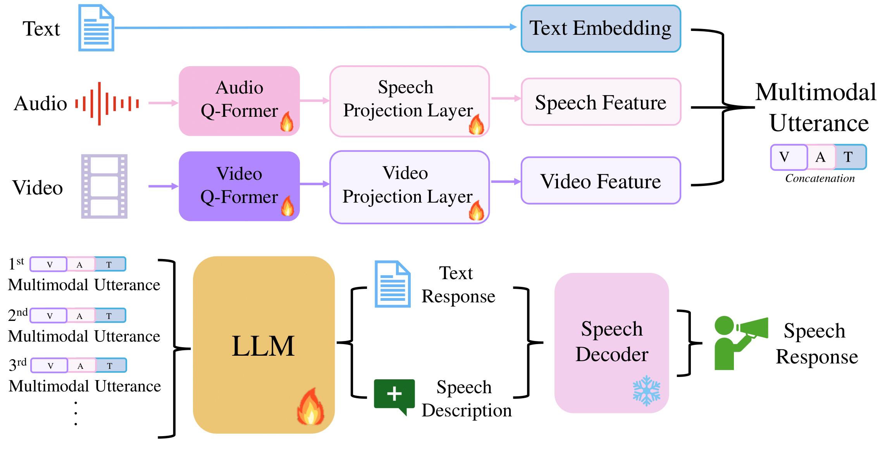

# MultiSensory Conversational Agent

This repository contains a pytorch implementation for the Interspeech 2025 paper, "Towards Human-like Multimodal Conversational Agent by Generating Engaging Speech".

[](http://arxiv.org/abs/2509.14627)
[](https://kimtaesu24.github.io/)



## Requirment
* python 3.8.17
* install requirments
```
pip install -r requirment.txt
```

## Data Processing
- The pre-processing code for the MSC dataset is located in the `./data/preprocessing` directory.
    - For more detailed information, please refer to the `./data/preprocessing/README.md` file.
- The feature extraction code for MSC dataset is located in the `./data`
    - For more detailed information, please refer to the `./data/README.md` file.


## Repository Structure

The overall file structure of this repository is as follows:

```
Template
    ├── README.md                       
    ├── requirments.txt
    ├── data
    └── src         
        ├── train.py                 # implements a function for training the model with hyperparameters
        ├── inference.py             # implements a function for inference the model
        ├── utils
        │   └── utils.py             # contains utility functions such as setting random seed and showing hyperparameters
        ├── trainer
        │   └── trainer.py           # processes input arguments of a user for training
        ├── data_loader
        │   ├── MSE_data_loader.py
        └── models                      
            ├── architecture.py      # implements the forward function and architecture
            └── modules.py           
```

## Checkpoint

You can dowload pre-trained model _(text+audio+video modality)_ trained with **MSenC dataset** from below link:
- [<u>Google Drive</u>](https://drive.google.com/file/d/1KHHxHNNxM_fPSiyGQLMP3g-gU1bp--jS/view?usp=sharing)

(The pretrained checkpoints will be released shortly via Hugging Face)

## training

- You can train the model with MSC dataset with following command:

```
python train.py --data_name MELD --stage 1 --QFormer blip2 --max_len 200 --target text_description --audio_type wavlm --bs 6
python train.py --data_name MSC --stage 1 --QFormer blip2 --max_len 200 --target text_description --audio_type wavlm --bs 6
```
- We provide code for training with text targets (without using voice descriptions).

```
python train.py --data_name MELD --stage 1 --QFormer blip2 --max_len 30 --target text --audio_type wavlm --bs 8
python train.py --data_name MSC --stage 1 --QFormer blip2 --max_len 30 --target text --audio_type wavlm --bs 8
```

## Ablation
```
python train.py --data_name MELD --stage 1 --LLM mistral1 --target text_description --max_length 200 --QFormer blip2 --bs 6 --modal text --wandb_name Description-ablation --epoch 10 --save 2
python train.py --data_name MELD --stage 1 --LLM mistral1 --target text_description --max_length 200 --QFormer blip2 --bs 6 --modal text_audio --wandb_name Description-ablation --epoch 10 --save 2
python train.py --data_name MELD --stage 1 --LLM mistral1 --target text_description --max_length 200 --QFormer blip2 --bs 6 --modal text_video --wandb_name Description-ablation --epoch 10 --save 2

python train.py --data_name MSC --stage 1 --LLM mistral1 --target text_description --max_length 200 --QFormer blip2 --bs 6 --modal text --wandb_name Description-ablation --epoch 10 --save 2
python train.py --data_name MSC --stage 1 --LLM mistral1 --target text_description --max_length 200 --QFormer blip2 --bs 6 --modal text_audio --wandb_name Description-ablation --epoch 10 --save 2
python train.py --data_name MSC --stage 1 --LLM mistral1 --target text_description --max_length 200 --QFormer blip2 --bs 6 --modal text_video --wandb_name Description-ablation --epoch 10 --save 2
```

## Impact of LLM finetuning
```
python train.py --data_name MSC --stage 1 --LLM mistral1 --LLM_freeze --target text_description --max_length 200 --QFormer blip2 --bs 6 --modal text_audio_video --wandb_name "Audio Latent Generation" --epoch 10 --save 2
python train.py --data_name MELD --stage 1 --LLM mistral1 --LLM_freeze --target text_description --max_length 200 --QFormer blip2 --bs 6 --modal text_audio_video --wandb_name "Audio Latent Generation" --epoch 10 --save 2
```


## Citation

```
@inproceedings{kim25m_interspeech,
  title     = {{Towards Human-like Multimodal Conversational Agent by Generating Engaging Speech}},
  author    = {Taesoo Kim and Yongsik Jo and Hyunmin Song and Taehwan Kim},
  year      = {2025},
  booktitle = {{Interspeech 2025}},
  pages     = {4828--4832},
  doi       = {10.21437/Interspeech.2025-1075},
  issn      = {2958-1796},
}
```


