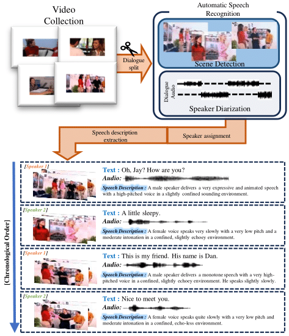
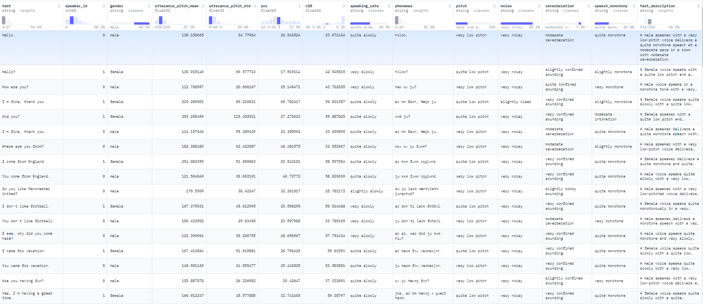

# English Conversation Dataset

## Preprocessing
- you can preprocess raw video to utterance video in `./preprocessing`.
- more details are writen on  `./preprocessing/README.md`.



## Feature Extraction

### 1. Video Feature Extract
```
python video_feature_extract.py
```

### 2. Audio Feature Extract
```
PYTHONPATH=unilm/wavlm python audio_feature_wavlm.py 
```

### 3. Mel-Spectrogram Extract
```
python audio2melspectrogram.py
```

### 4. Make csv format
run `./MSC/make_csv_data.ipynb`

### 5. Make Speech Description
- We follow the process of Parler-tts ([dataspeech](https://github.com/huggingface/dataspeech))


- you can download from [**huggingface dataset**](https://huggingface.co/datasets/TAESOO98/msc-audio-transcript)
